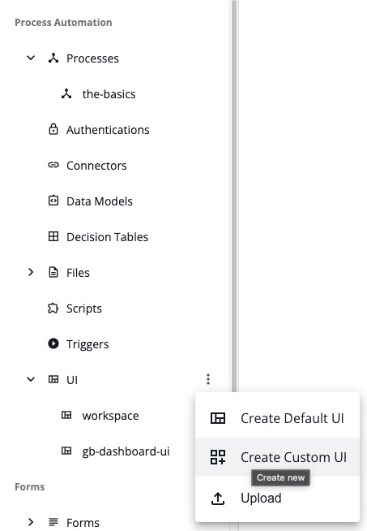
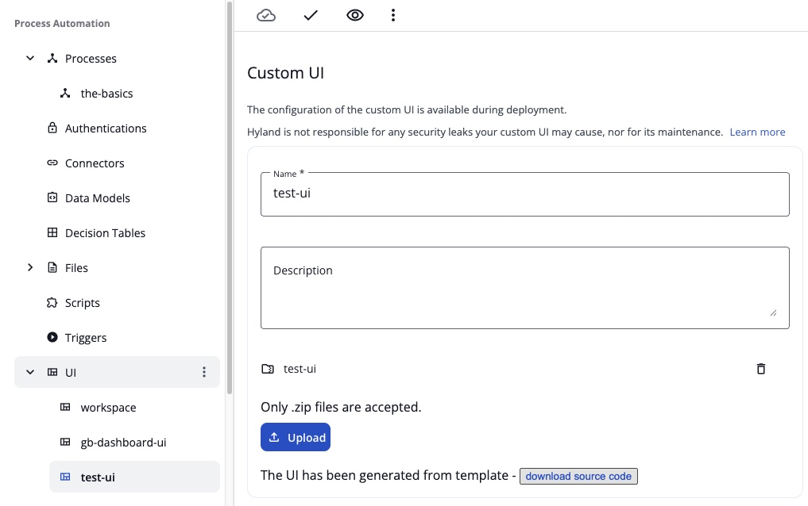
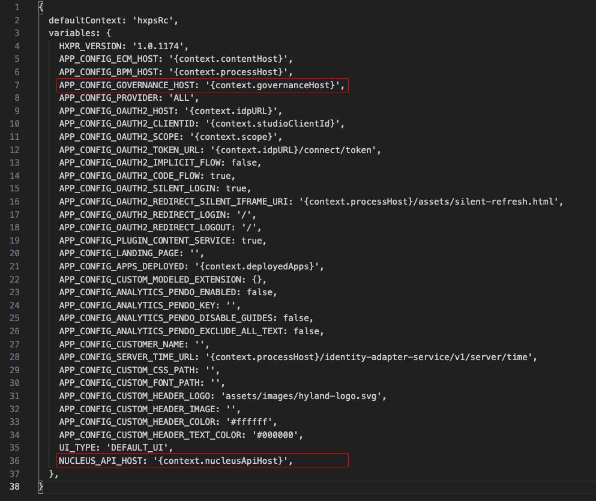
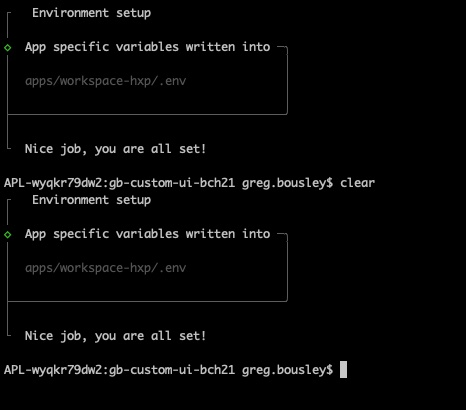
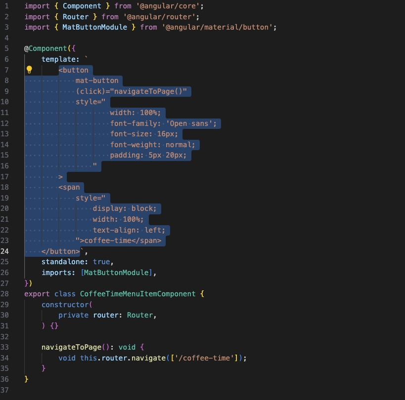
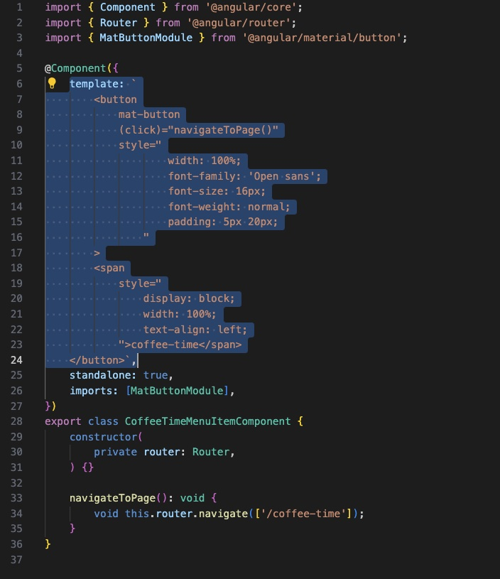
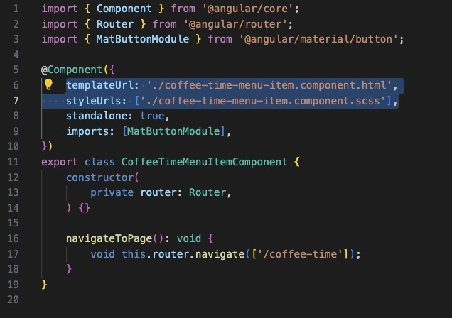
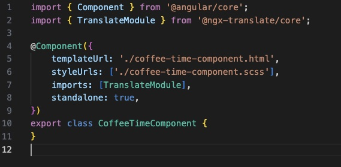

## Create a Custom UI Within Automate

**Disclaimer:** 
- Ensure you have installed nvm and Node.js by following the steps in the [ReadMe](/README.md) page.
- Using Visual Studio Code is strongly recommended since you'll be editing .html, .ts and .json files. You'll also need to use a Terminal window and VS Code allows you to open a terminal window from within the app to run necessary commands and provides a convenient dev experience.
- Before building a custom UI you should have an application in Automate that contains at least one process you want to launch. If not, build one before starting this guide.

**Scenario:** 
I built this custom UI with the idea in mind that the target audience wuld be an internal Insurance Claim team that uses their own UI portal to start claims on behalf of customers. The idea is that the custom UI is relevant in that it can be tweaked to remove assets from the default UI that you would not want the claims team members to have access to, i.e.: you only want them to process claims, not access any other processes or repositories. Please feel free to customize this to your own scenario, or follow the guide as is.

### Generate a Custom UI & Download / Configure Source Code
**Summary:** 
This portion will show you how to create a custom UI within your application, download the source code, and configure a local development environment.
1. Within Automate Studio Modelling, select the **Create Custom UI** option from the UI drop-down header in the left menu.

2. In the pop-up box, give it a name and optional description.
3. On the Custom UI Configuration page (should automatically navigate to this), select the **“Generate from template <>”** button. The page will generate a template and display a **download source code** button below the configuration details.
4. Select the **download source code** button. A zip file containing the source code for the UI will be downloaded. Place the file on your local machine where you want it and unzip the file. You now have the UI downloaded.

5. Release the application containing the custom UI you just downloaded. 
6. Within Studio Admin, deploy the process. On the first tab of the deployment wizard, **select the Enable local development checkbox**. This is necessary in order to run the Custom UI from your local machine during development - VERY IMPORTANT!
7. Once Deployed, from the running Application Instance menu, choose **Development Configuration**.

8. Use the **Copy as JSON** hyperlink on the popup window to copy the config as JSON to your clipboard and save it to a notepad / document locally on your machine. You'll use this code later in your local dev environment. 
9. If you have not already, unzip the source code archive you downloaded in step 4. Navigate to and open the file named: **contexts.json5** located at the following directory: ```config\contexts.json5```. Paste the copied JSON from Steep 8 over the entire contents of this file. SAVE IT! You may close the file once this is done, as you will not edit it any more.
<!--
10. **As of this writing, a bug was introduced to Automate that added support for governance but did not propogate to custom UIs causing an error with the next step**. This step is a workaround hot fix for this bug and will be removed once the product has been permanently solutioned. 
    - In your local UI files, find and open the file titled ```project.variables.json5``` found at this path: ```apps/workspace-hxp/```.
    - You need to delete the following two lines of code in this file. (Once deleted remember to **save the file**. You may also close the file once you've deleted these lines as you won't edit it any more):
```
...
APP_CONFIG_GOVERNANCE_HOST: '{context.governanceHost}',
...
NUCLEUS_API_HOST: '{context.nucleusApiHost}',
```
   - Refer to this screenshot of what lines to delete (Remember to save the file after deleting these lines!):

-->
10. Next, you'll need to open a Terminal window at the root directory of the downloaded source code. If this is new to you, here are the ways you can easily do this:
    - **Using Visual Studio Code:** In VSCode, use the **File** drop down selection at the top of the window and select _Open Folder_. Navigate to and select the folder of the downloaded source code. Once opened, you'll notice that the file heirarchy will be on the left side panel, which will give you access to open and edit files within the UI structure for later. To open a terminal window, select the **Terminal** drop-down at the top of the window and select _New Terminal_. A terminal panel will open at the bottom of VS code placing you in the directory of the folder you opened in this step. You're now ready to proceed to the next step of running the terminal commands.
    - **MAC OS: Using Terminal outside of VS Code:** Using your file explorer (Finder), navigate to the folder of your downloaded source code. RIGHT-CLICK on the folder and select _services_ from the right-click menu. Select _New Terminal at Folder_ from the menu. A terminal window should open at the file location. You're now ready to proceed to the next step of running the terminal commands.
11. **Running Terminal commands:** You're almost done!
    - Install all the necessary dependencies by running the following command in Terminal:
        ```
        npm i
        ```
    - Set up the environment variables by running the following command in Terminal: 
        ```
        npm run setenv
        ```
**Note:** At the time of this writing, this command will print a long string of information which may include some warnings and deprication messages. As long as the final message looks like this screenshot, you are good to go!

    - Run the application by running the following command: 
        ```
        npm start workspace-hxp
        ```
      - Once building the UI is complete it should launch automatically in a browser window, but in case it does not you can view the UI manually by opening your browser and navigating to this address: ```http://localhost:4200/```
12. Your Custom UI should launch in the web browser and will look like the default UI. Some things to note:
    - Your local UI will be running in your localhost. Remember to STOP the local UI whenever you are done testing it (and before proceeding to the next section). You can stop the local environment from running by pressing CTRL+C in the terminal window.
    - Being an asynchronous Angular environment, most changes can be made to the files while the UI is running. Editing and saving a file will automatically update/refresh the UI.

### Creating a Plugin and a Page
**Summary:** 
A Plugin is first necessary in order to create a Page, so don't skip step 1. A Page loads into the main content window of the UI. This guide will show you how to create and customize your own page and add a button for navigation.
1. **Creating a Plugin:** Open a Terminal window at the root directory of the downloaded source code (if not already open from the previous section). Paste and execute the command below to create a plugin for your page:
**NOTE: I titled my plugin "ninesi". Replace the text "ninesi" in this command line with the title you want to use. This will not be the formal name of your page, just the behind-the-scenes name for your plugin. For simplicity, feel free to use my plugin and page names unless you prefer your own names.** 
```
npx nx generate @hyland/extend:plugin --name ninesi --author "Greg Bousley" --addTranslations true
```
   - The Plugin created will not have any noticeable functionality, but will add configuration to the correct files to support the page you'll create in step 2. 
2. **Create a Page** Execute the following command in order to create a page with button added to the left pane to navigate to your page:
** NOTE: You must replace the text "ninesi" in this code with the same plugin name you used in step 1 (if you used your own plugin name) **AND** replace the text "nine-si" with the formal name of the page you want to create (if you're using your own page name). NOTE: Do not use any spaces or numbers when creating a page name as it does not work with the generator (The actual formal name that is displayed on buttons / pages can be edited later).**
```
npx nx generate @hyland/extend:page --pluginName ninesi --pageName nine-si
```
3. Run the build command in order to test that your plugin page is working. You should see a new button at the bottom of the left hand navigation pane with the name of the page you specified. Click the button and you'll see a generic message in the main content pane that the plugin is working.
```
npm start workspace-hxp
```
4. If your page is working, navigate back to terminal and stop the instance using CTRL+C.
5. The plugin generator created new files for this plugin, which can be found at the following directory. Open finder/explorer and navigate to this directory: ```libs/plugins/yourpluginname/src/lib/pages/yourpagename```.
   - You should see a few files here: ```yourpagename-menu-item.components.ts```, ```yourpagename-compnents.ts```, and ```yourpagename-module.ts```.
6. Next, you'll need to create a few new files in this directory and paste some html code into those files. I found it easiest to use Visual Studio to create a new file and save to this folder. **NOTE:** Replace all instances of the text "yourpagename" with the actual page name you used in Step 2. Follow these steps in VS:
   - Create a new file and save it in the directory in **step 5** as: ```yourpagename-menu-item.component.scss```. Leave the contents of this file empty. 
   - Create a new file and save it in the directory in **step 5** as: ```yourpagename-menu-item.component.html```.
   - Open the file in that same directory that is titled: ```yourpagename-menu-item.component.ts``` in Visual Studio. In this file, you'll notice a string of HTML code that is surrounded by a single quote (literal string) which is the value of the "template" object. Copy the code between the single quotes, **do not copy the quotes**, and paste the code into the newly created .html file from the step above. (See this screenshot as an example of what to copy).

     - Inside of the ```yourpagename-menu-item.component.ts``` file, you will replace the template object with the following 2 lines of code, ensuring that you use **your page names** in these lines. Refer to the before and after images below:
code:
```
    templateUrl: './yourpagename-menu-item.component.html',
    styleUrls: ['./yourpagename-menu-item.component.scss'],
```

* This is the code you will replace:<br>


* This what it should look like afterward (but using your page names in place of "coffee-time" in this image):


   - Create a new file and save it in the directory in **step 5** as: ```yourpagename-component.scss```. Leave the contents of this file blank.
   - Create a new file and save it in the directory in **step 5** as: ```yourpagename-component.html```. 
   - Next, we will edit the component file that will reference the html & css files we created as well as add the functionality to launch a page and start a process. Open the file in this same directory titled: ```yourpagename.component.ts```.
     - In this file, you will replace the **template** and **selector** properties from the @Component with two properties for **templateUrl** and **styleUrls** with relative paths to the html and style sheet files that you just created using the following code. 
```
    templateUrl: './yourpagename-component.html',
    styleUrls: ['./yourpagename-component.scss'],
```
- Next, at the top of the file, add the following import: ```import { Router } from '@angular/router';```.
- Finally, within the **export class** constructor (inside of the brackets "{}"), add the following code inside of the hard brackets "[]", replacing the text "yourpagename" with your page name (do not remove the "/"):
```
    constructor(
        private router: Router,
    ) {}

    navigateToPage(): void {
        void this.router.navigate(['/yourpagename']);
    }
```
- Refer to the screenshot below as to what your file should look like (remembering to replace my page name with yours):


7. Open the file you created earlier titled ```yourpagename-component.html``` and add the following code: ```<p>This is working!</p>```.
8. All manual file additions and edits are done for core functionality and you may now test the application.
   - Ensuring all edited files are saved, go back to Terminal and launch the UI using the command: ```npm start workspace-hxp```.
   - When the UI loads, click on the button that appears (your page name) below the navigation on the left-side panel to load your page. You should see the message in the main content pane: ```This is working!```.
   - **If you get any errors** refer to [this page](sanity-check/page-comparisons) in this github and compare your file content to mine to ensure everything is correct, ensuring that you replace all instances of my page name with the page name you used (if other than "nine-si").
9. Add your custom HTML code to create your new page design:
   - In the ```yourpagename-component.html``` replace the contents of this file with the following code. **NOTE:** You MUST replace the ```yourprocessname``` in the "a href" URL in the code below with the name of the process in your application. 
```
<!-- GB HTML -->
<style>
    .chewy-regular {
        font-family: "Chewy", system-ui;
    }
      
</style>
<div style="width:100%; background-color:azure;">
    <div id="header" style="height: 85px; background-color:steelblue;">
        <!--
        <div style="float: left;">
            
        </div>
         -->
        <div id="header-text" style="padding: 22px 0px 0px 20px;">
            <div class="chewy-regular" style="font-size: 34px; font-weight: bold; color:#FFF;">9-SECOND INSURANCE</div>
        </div>
        
    </div>
    <div id="banner" style="height: 800px; text-align: center; background-image: url('assets/images/background.jpeg'); background-position: center; background-repeat: no-repeat; background-size: cover;">
        <div style="height: 420px;">&nbsp;</div>
        <div style="font-family:Georgia, 'Times New Roman', Times, serif; font-size: 40px; font-weight: bold; color: #FFF; ">CLAIMS PORTAL</div>
        <div style="height: 10px;">&nbsp;</div>
        
        <div style="padding: 20px 14px 20px 14px;">
            <button
            mat-button
            (click)="navigateToPage()"
            style="
                    width: 200px;
                    height: 60px;
                    background-color:#555;
                    border-radius: 10px;
                    border: thin solid #444;
                    text-align: center;
                "
            >
            <a href="http://localhost:4200/#/start-process-cloud?process=yourprocessname" target="_self" style="color:aliceblue;">
                <span
                style="
                    text-align: center;
                    color: #FFF;
                    font-family: 'Open sans';
                    font-size: 20px;
                    font-weight: bold;
                    color:aliceblue;
                ">START A CLAIM</span>
            </a>
            </button>
        </div>
        
    </div>
</div>
```
10. Since this HTML code loads a few images, we need to add them to the proper directory so they will exist at run-time. In finder/explorer, navigate to the folder at the following path: ```apps/workshop-hxp/src/assets/images```. Download the two image files in this github found [here](./images-for-ui/) and place them in that folder. 
11. Ensuring all edited files are saved, return to Terminal and launch the application once again using the command: ```npm start workspace-hxp```.
    - Selecting your page button should load your html page within the content pane showing a site  


### Building and Uploading your Custom UI to Automate
**Summary:** 
Now that you have a local developed custom UI, you'll need to build it into a package and upload it to your Custom-UI configuration within your process in Automate in order for your attended audience to see it.
1. In Terminal, navigate to the root level of your local custom UI.
2. Use the following command to build and package your UI: 
```
npm run pack-build workspace-hxp
```
3. Once this command is complete, files for this UI will be placed within the following directory: ```dist/workspace-hxp/```. Select all of the files within this folder (**Not the Folder itself**) and create a .zip archive. 
4. In Automate, go into **Studio Modelling** and open the process that you created this Custom UI from. On the left hand panel, toggle down the **UI** header and select your custom UI to open it's configuration. Use the blue **Upload** button to upload the .zip archive you created in Step 3, confirming replacement when prompted to do so. (Use the following screenshot as a guide):


5. Save the process, release, then navigate to **Studio Admin** and Upgrade the project. Test all is working by launching the custom UI name instead of the Workspace UI when Upgrade is complete.